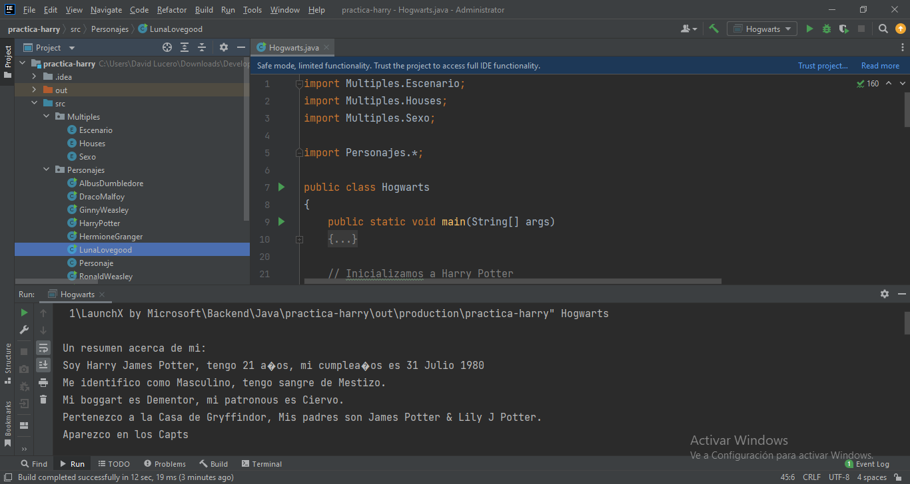

### practica-harry
En esta práctica se realiza la abstracción y modelado de personajes de la saga Harry Potter. 
Identificamos las caracteristicas más importantes de los personajes de la saga harry Potter, debemos crear un modelo que nos permita representarlos en el IDE Intellij usando el lenguaje de programación Java.

## Funcionamiento en el Intellij

## Diagramas de clase UML

