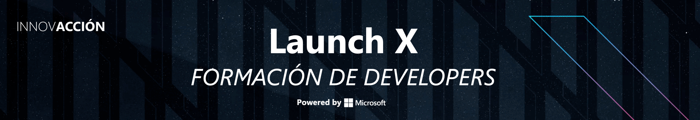

# LaunchX-by-Microsoft  🚀
### Este repositorio corresponde a las practicas tanto OnBoarding, Frontend y Backend de programa Developer FullStack, 
LaunchX del Innovacion Virtual by Microsoft

## Mission Comanders del LaunchX
* ### OnBoarding [Fernanda Ochoa](https://github.com/RMEstefania)
* ### Frontend: [Rodrigo Martínez](https://github.com/romarpla)
* ### Backend NodeJS [Carlo Gilmar](https://github.com/carlogilmar)
* ### Backend Java [Fernanda Ochoa](https://github.com/RMEstefania)

## Descripcion General del Programa
En este programa se vio las dos ramas principales tanto el Frontend y el Backend que al principio fue como un entrenamiento
para reforzar nuestros conocimientos fundamentales sobre la programacion.
### Descripcion del Frontend
En esta misión se vio la introducción a la programación web Frontend.
Aprendimos lo fundamental para crear aplicaciones web e increibles al talvez de nuestras ideas y poder traerlas al mundo real para convertinos en un Developer FullStack.
Pudimos crear estructuras de interfaces de las más conocidas aplicaciones que ya utilizamos, hasta poder hacer ejemplos creados con nuestras propias manos en una de las mejores infraestructura del mercado que es Azure Microsoft.
Aprendimos diferentes tecnologías como HTML, CSS y JS, VueJS, VueX y Angular que son frameworks muy poderosos que te permitirán hacer cosas increibles.
### Descripcion General del Backend
En esta misión general se vio sobre Java y NodeJS como backend, pudimos entender el funcionamiento de los sitios webs/paginas que consumimos día a día, 
sabemos los conceptos como API'S, Bases de Datos, Servidores, Frameworks.

## Practicas de las misiones
En esta seccion podras encontrar mis practicas realizadas en el transcurso de todo el programa del Launchx
### Practicas del [OnBoarding](https://github.com/DavidLuceroSigcho/LaunchX-by-Microsoft/tree/main/OnBoarding-Python/Ejercicios-Python)
En esta seccion puedes encontrar mis practicas que realize en OnBoarding que se uso el lenguaje de programacion Python.
### Practicas del [Frontend](https://github.com/DavidLuceroSigcho/LaunchX-by-Microsoft/tree/main/Frontend)
En esta seccion puedes encontrar mis practicas que realize en Frontend que se uso las tecnologías como HTML, CSS y JS, VueJS, VueX y Angular.
### Practicas del [Backend Java](https://github.com/DavidLuceroSigcho/LaunchX-by-Microsoft/tree/main/Backend/Java)
En esta seccion puedes encontrar mis practicas que realize en el Backend que se uso el lenguaje de programacion Java y sus pilares.

Nota: Estare subiendo poco a poco las practicas faltante que en estos dias.

### Gracias por visitar mi repositorio, lo realize con lo aprendido en LaunchX de Innovaccion Virtual by Microsoft.